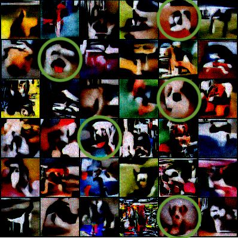
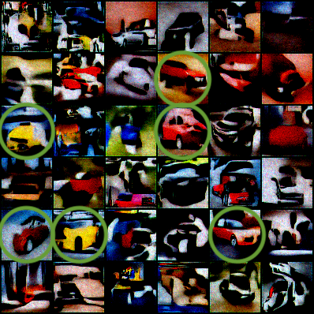
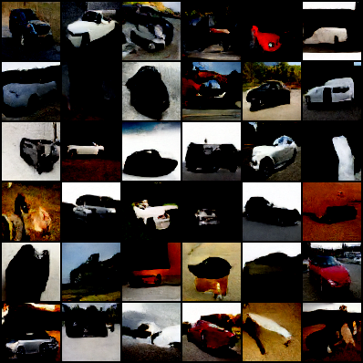
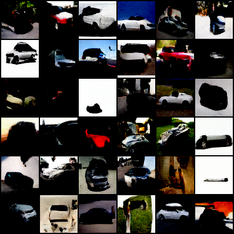

<!--   We attempt to generate class-conditional images using a probabilistic
  diffusion model by adapting to the latter class-conditional techniques
  initially developed for *GANs*. In particular, we experiment two
  architectures, one leveraging *Conditional Batch Norm* and one
  integrating an *Auxiliary Classifier*, testing different resolutions
  and configurations. The results suggest that these approaches cannot
  be applied to diffusion models as they are: the *CBN* architecture
  results in class-conditional images that do not look realistic while
  the *AC* one yields prettier images but fails to capture the
  conditionality. -->
---

# Introduction

Richard Feynman once said that:  
"What I cannot create, I do not understand."

and, in the context of machine learning, this means that for machines to
understand their input data, they should learn to create it. Moreover,
being able to generate unseen images opens the door to some
groundshaking applications, from super-resolution, to text-to-image
translation.

Image synthesis nevertheless has been one of the most challenging tasks
for machine learning to tackle. In fact, generative models are needed to
generate new unseen images; but while we witnessed a huge leap forward
in discriminative models during the first years of the last decade
thanks to neural architectures, generative models initially failed to
keep up. It was in $2014$ that *Goodfellow et al.* came up with
*Generative Adversarial Networks* [@goodfellow2014generative]. GANs and
their evolutions have been the state-of-the-art since then, but a very
recent paper shows that similar performance can be obtained with a
different model that leverages probabilistic diffusion in order to
generate images [@ho2020denoising].

Generative models have also been particularly useful to create
artificial examples in order to augment datasets [@data-augmentation],
but in order to generate new images belonging to a certain class, one
would need to have a conditional model. Goal of this research is
therefore to integrate class-conditionality in probabilistic diffusion
models.

# Related work

As anticipated, the most used generative architecture is *Generative
Adversarial Networks* [@goodfellow2014generative], which is composed of
two networks that are trained *adversarily*: a *generator* is trained in
such a way that a *discriminator* cannot distinguish between its
generated samples and the real ones, while simultaneously training the
discriminator to be able to distinguish between fake samples and real
ones. To integrate class-conditionality in GANs, various approaches have
been tried: *Brock et al.* provide class information to the generator
with *conditional batch norm* [@Brock2018gan], while *Odena et al.*
leverage an auxiliary classifier [@odena2017conditional].

# Proposed method

A *diffusion probabilistic model* is a parameterized *Markov chain*: A
Markov chain models the state of a system with a random variable that
changes through time. For the Markov property to hold, the distribution
of a state must depend only on the distribution of the previous state.

The training phase consists of two phases: a forward pass and a reverse
pass, as can be seen in [1](#fig:markov). In the former, also called the diffusion
process, Gaussian noise is added to the image according to a fixed
schedule so each transition in the Markov chain
$q(\mathbf{x}_{t}| \mathbf{x}_{t-1})$ represents the addition of
Gaussian noise. In the latter, the transitions of a reverse Markov chain
are learned in order to reconstruct the destroyed signal; the parameters
are learned by optimizing the variational bound on negative
loglikelihood:

$$\mathbb{E}\left[ - \log p_{\theta}(\mathbf{x}_0) \right] \leq \mathbb{E}_q \left[ - \log \frac{p_\theta (\mathbf{x}_0, \dots, \mathbf{x}_T)}{q(\mathbf{x}_1, \dots, \mathbf{x}_T|\mathbf{x}_0)}\right] = \mathbb{E}_q\left[ - \log \ p(\mathbf{x}_T) - \sum_{t \geq 1} \log \frac{p_\theta (\mathbf{x}_{t-1}|\mathbf{x}_t)}{q(\mathbf{x}_t | \mathbf{x}_{t-1})} \right]$$

We employ the architecture suggested by the original paper, in which the
denoiser is a *U-Net* [@U-net], shown in
[2](#fig:u-net).

## Conditional Batch Norm

*Conditional Batch Normalization* was first applied to language-vision
tasks to implement the intuition that the linguistic input should
modulate the entire visual processing, instead of being fused only in
the last part of the process. *CBN* builds upon *Batch Normalization*,
in which each batch is normalized as follows to reduce the internal
co-variate shift
$$\text{BN}_{\gamma, \beta}(x_i) = \gamma_i \frac{x_i - \mathbb{E}(x_i)}{\sqrt{var(x_i)}} + \beta_i$$
In *CBN* we want to predict $\gamma$ and $\beta$ from an embedding of
the class, so that the class may manipulate entire feature maps by
scaling them up or down, negating them, or shutting them off completely
[@odena2017conditional].

The integration of *CBN* in the architecture is done by replacing the
*Batch Norm* layers inside the denoiser architecture with *conditional*
ones. We are going to refer to the model obtained by adding *CBN* to the
original model as $M_{CBN}$.

## Auxiliary Classifier

Analogously to what has been done in [@odena2017conditional] for GANs,
we have added an auxiliary classifier to the original architecture of
the denoiser.

To provide the class information to the denoiser, the label is embedded
and reshaped to be the same dimension as one of the channels of the
image, *i.e.* $w \times h$, and then concatenated to the input image in
the channel dimension. Images are thus tensors of shape
$(b, c+1, w, h)$, where $b$ is the batch size, $c$ is the number of
channels (RGB), $w$ is the width and $h$ is the height.

The overall loss is then obtained as a weighted sum of the variational
loss to account for the reconstruction error, and the classifier loss,
which is a categorical cross entropy, where the weight is a
hyper-parameter. The loss should this way be enriched with class
information that should backpropagate to the parameters that are
involved in the generation.

We are going to refer to the model obtained by adding the auxiliary
classifier to the original model as $M_{AC}$.

# Dataset

We based our implementation on the following repository
[denoising-diffusion-pytorch](https://github.com/lucidrains/denoising-diffusion-pytorch),
which provides a working PyTorch baseline.

Our original goal was to apply the model to the [insect-pest
dataset](https://openaccess.thecvf.com/content_CVPR_2019/papers/Wu_IP102_A_Large-Scale_Benchmark_Dataset_for_Insect_Pest_Recognition_CVPR_2019_paper.pdf)
to create new artificial samples for dataset augmentation. The original
dataset consisted of over $75k$ images, but most of the classes had few
samples and low variance between them, we therefore used a subsample of
$5$ classes, ammounting to $\approx 25$k samples. The dataset is not
really what a data scientist would dream of, as no bounding boxes were
provided, and it is often hard even for humans to understand what's in
the image. To attribute the right degree of responsibility to the model
and to the dataset, we also tested the model on a different dataset from
Stanford, containing $\approx 20k$ images of cars.

To test our proposed conditional methods, to simplify the visual
inspection of the results, we instead created an ad-hoc dataset of only
two classes with the aim of maximizing the difference between them. To
this end, we took a subset of $\approx 10k$ images from the *Stanford
dogs* and the *Stanford cars* datasets.

# Results

All the unconditional and conditional versions of the model that follow
have been trained for $\approx 100$ epochs. The unconditional model was
first tested on the insect-pest dataset, yielding the results in
[3](#fig:insects-64).
As anticipated, we then tested it on the same dataset at higher
resolution, yielding the results in
[4](#fig:insects-128),
and on the cars dataset with the same resolution, resulting in
[5](#fig:cars-64). As it
is evident from the samples, the resolution plays a strong role in
generating realistic images, providing the model more information to
leverage for the generation. The Inception Scores are as follow

| 		      | 64 			| 128		  |
| :---------: | :---------: | :---------: |
| insects     | 4.2      	| 4.08		  |
| cars		  | 3.32        |			  |

Regarding the conditional model, the two proposed methods yielded
totally different results. $M_{CBN}$ converges to a small reconstruction
error, and the class of the generated images can often be inferred
visually; see for example [6](#cbn) which is a batch of generated images for the 'dog' class and
[7](#fig:cbn-generated-cars) which is a batch of generated images
for the 'car' class. 

class 'dog'             |  class 'car'
:-------------------------:|:-------------------------:
  |  

Nevertheless, the results appear as messy color
spots which do not resemble any realistic image. As the reconstruction
error is small, the problem seems to be related to the sampling
procedure, and indeed it might be the case that the class information is
not accounted for correctly during sampling, as the *CBN* is only part
of the denoiser and class information does not influence the rest of the
sampling process.

To check whether there is a class-related distinction between the
generated images, we plotted the images with *t-SNE*, yielding the
results that can be seen in
[11](#fig:cbn-t-sne-points) and
[12](#fig:cbn-t-sne-images). The points seem to be fairly
separable, indicating that the class is indeed infused in the generated
images.

$M_{AC}$ instead results in the converse, yielding almost realistic
images that do not seem to be much influenced by the class. As a first
attempt, we tried training the random-initialized classifier with the
rest of the architecture; this resulted in a rapidly decreasing
classifier loss that did not help the generation at all, but instead
seemed to only worsen the results. To our advise, this was due to a
process of co-adaption in which the parameters of one computational
block were set to satisfy the other, and viceversa. To address this
issue, we pretrained the classifier until convergence on the dataset of
real images and then kept its parameters fixed during the training of
the rest of the model. This yielded the results in
[9](#fig:ac-generated-cars) and
[8](#fig:ac-generated-dogs); 

class 'dog'             |  class 'car'
:-------------------------:|:-------------------------:
  |  

The images resemble cars, mostly
ignoring the input label. We eventually tried feeding higher-resolution
images to the model, but with no significant improvement. The generated
images in fact do not resemble their class, but the classification loss
still goes rapidly down; to provide an explanation, we visually
inspected the images and found out that artifacts were present in every
image ([10](#fig:ac-generated-128)), probably resulting from the
generator 'tricking' the classifier, emphasizing features that resulted
in high confidence guesses in the latter. 

We concluded that the model
was not robust enough, and therefore tried to employ a finetuned
*ResNet18* classifier, but this did not solve the issue.

As before, we plotted the images with *t-SNE* to check whether there is
a class-related distinction between the images; as can be seen in
[13](#fig:ac-t-sne-points) and
[14](#fig:ac-t-sne-images), this time the points are all mixed up,
indicating that the model fails to conditionate the generation on the
class.

# Conclusions

The proposed methods do not yield acceptable results, indicating that it
is not enough to adapt GANs techniques for class-conditionality to
probabilistic diffusion models, while this is also not straightforward
to do. This also emphasizes that, while seemingly close to GANs, this
family of models requires ad-hoc research, as they are based on
different theorical aspects.

<!-- # Additional resources -->

<!--  -->

<!-- 
 -->
<!--  -->

<!-- 

 -->

