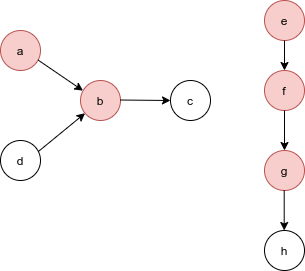

---

# Introduction

## Motivation

What is virality? Virality, in its original meaning, refers to viruses
that can only survive by continously spreading from one host to another
in a parasitic manner; Actually, many real life phenomena exhibit a
*spreading behaviour* to which we can extend the notion of virality.

The ability to predict the spreading potential of a certain signal has
evident benefits, for example providing a mean to prevent the spread of
undesired phenomena such as diseases or fake news, but also allowing
companies to exploit this information to improve their advertising
campaigns.

*Graphs* serve as an useful abstraction to model real world situations,
and are well suited to represent spreading patterns:

-   *nodes* represent components of interest (e.g. users in a social
    network);

-   *edges* define existing relations among these components;

-   *node signal* represents the information, which is generated from
    some source node, and is propagated to its neighboring nodes through
    its edges, possibly iterating the process until all the nodes have
    been reached.

## Task formalization

A spreading piece of information $m$ originates a *cascade* in the
network, to formalize the problem as a learning task we distinguish two
sets, namely

-   *early adopters*, and

-   *final adopters*.

The former are the ones producing the information as they don't receive
it from other nodes, while the latter are those who adopt the
information at the end of the propagation process, or, if you think
about it as a disease, those who get infected.

In the example, the information is originally produced by nodes $a$ and
$e$ independently, and is then spread in subsequent moments until it
stops. The final adopters will be all the nodes who have been reached by
the information, including the early adopters.

So, after a preprocessing step, each node will be characterized by the
following two features

-   whether it is an early adopter:
    $$s_{v}^{(0)} = \text{initial activation state of node } v$$

-   and whether it is a final adopter, which is the label we want to
    predict: $$s_{v}^{(T)} = \text{final activation state of node } v$$

The final virality coefficient for the piece of information $m$ is
eventually obtained by counting the final adopters.

  \begin{align}
  \mathcal{P}_{m} = \sum_{v \in \mathcal{V}} s_{v}^{(T)} = n_{\infty}^m
  \end{align}

## Approaches

As a node prediction task, both *feature-based* methods and
*representation learning* methods can be exploited. The former approach
heavily depends on the quality of the hand-crafted features, which are
generally extracted heuristically, while the latter allows to
automatically learn representations of node statuses which are suited
for the task at hand. A possible way to do this is by embedding the
graphs into a vector space, and then using conventional representation
learning techniques; nevertheless, a more natural approach would be to
instead generalize the machine learning models to non-euclidean domains:
in the case of deep learning models, this is usually called *geometric
deep learning*.

# Data

For our task, both synthetic data and real world data have been used.

## Synthetic data

The synthetic data generation involves two steps:

1.  generating the social structure of interest;

2.  generating a certain number of information cascades;

### Social structure

To artificially generate a social network structure which resembles a
real one, *random graph models* are usually used. A good model should
allow creating graphs for which the degree distribution follows a
power-law, as happens in real social networks.

A power law is a functional relationship $y = ax^{-c}$ between two
quantities, where one quantity varies as a power of the other.

By applying the logarithm to both parts we have that $$\begin{aligned}
    y &= ax^{-c} \\
    log(y) &= log(ax^{-c}) \\
    log(y) &= log(a) -c \cdot log(x)\end{aligned}$$ As a consequence, we
get that a power law appears as a line in a log log scale plot, as can
be seen in the Twitter degree distribution in figure.

In the social network context it means that it is exponentially more
likely to pick "normal people" with few friends or followers rather than
popular profiles, called "celebrities" or "authorities".

For this reason we opted for a *preferential attachment* model, which
works in the following way: you begin with a single node with a self
loop, when you have built a graph with $N-1$ nodes, you add the $N$-th
node with an edge that goes from $N$ to a node $i$ chosen accordingly
with a probability proportional to the degree of $i$.

Inductive definition of the model:

-   Base step: $G_1$ is a single node with a self loop;

-   Inductive step (for $i = 2, 3, \ldots$):

    1.  add node $i$ to $G_i$;

    2.  add a "*half edge*" coming out from node $i$;

    3.  choose a node $j$ randomly with probability proportional to its
        degree, i.e.,
        $$
        \mathcal{P} \left( \text{neighbor of $N$ is $i$} \right) = \frac{deg(i)}{\sum_{k=1}^{N} deg(k)}
        $$,
        where the denominator is a normalization factor;

    4.  close the *half edge* from $i$, by connecting it to $j$.

### Information cascades

The cascades are generated with the *Independent Cascades* model, which
works in the following way: Let's assume we have $k$ nodes holding some
piece of information (the seed set), the time is discrete and this
information spreads over time.

-   at time $t_0$ the only persons having the information will be the
    ones in the seed seet;

-   at time $t_i$ for each of the edges incident on the nodes having the
    information we will be flipping a coin:

    -   with prob $p$ the information will spread on that edge;

    -   else the edge is lost forever.

## Real data

Similarly to the synthetic data generation, the process to obtain real
data from Twitter involved two steps:

-   retrieving the social network relative to a subgraph of Twitter;

-   obtaining the cascades from the tweets of the users in the subgraph.

### Social structure

To obtain a subgraph of Twitter we scraped the social network in a
*Breadth First*-fashion

-   start with a queue containing a random english speaking user;

-   collect all his followers and followees and add them to the queue;

-   pop the next user from the queue and repeat step 2 until the desired
    number of users is reached;

### Cascades

Given the set of users $U$ collected in the previous step, we obtained
all the tweets published by users in $U$ that fell in a certain
time-window.

So, obtained the hashtags from the set of tweets, we recreate for each
distinct hashtag a propagation cascade in the following way:

1.  order the tweets containing the hashtags by timestamp;

2.  create the first cascade with the first tweet author as root node;

3.  for each remaining tweet $t$:

    1.  let $u$ be the node relative to the author of $t$;

    2.  if $u$ has an incoming edge from an existing cascade tree $c$,
        then add it to $c$;

    3.  else create a new cascade tree with $u$ as root;

The roots of the cascade trees were used as early adopters, the
remaining nodes as final.

The scraping process resulted in a dataset containing $~30k$ users
connected by $~400k$ edges, which published a total of $12912921$
tweets. Among these, \[..\] contained hashtags, if an hashtag was posted
more than once from the same user in the given time window it was
considered only once.

### Sparsity

The collected dataset, as you can see in the first plot, suffers from
severe sparsity; Most of the hashtags appear in tweets of just one or
two distinct authors.

Even worse, also ignoring hashtags which have been tweeted only by one
author, most of the cascades are shallow.

In the piechart, we see that among all the cascades the great majority
of them is just made of a single node, meaning that in most cases there
is no spreading tree structure at all, but rather a set of indipendent
nodes who hold the same information.

This is due to two reasons:

-   first, virality is intrinsecally rare: this may result surprising to
    us because we can come up with many viral examples, but this is a
    biased sampling because all the contents which are not viral don't
    come up to our minds because we never see them at all; If we take
    the ratio of viral contents over all the contents we would in fact
    see that they are a great minority;

-   second, we are observing a small subnetwork of the real social
    network; this way, cascades that would be deep in the real network
    may instead appear to us a set of independent shallow cascades, as
    the subgraph is by construction incomplete and may therefore miss
    the nodes which keep the subcascades connected in the real network;

## Node features

The representation learning techniques may fail to capture some local
node properties, for this reason these can be preprocessed and used to
enrich the nodes before passing them as input to the model;

For each node, we computed the following features:

-   *local clustering coefficient*, which quantifies how close its
    neighbours are to being a clique; $$\begin{aligned}
        C_{i} &= \frac{\text{\# of existing edges in $N(v_i)$} }{\text{\# of all possible edges in $N(v_i)$}} 
      \end{aligned}$$ where $N(v_i)$ is the neighborhood of $v_i$ and
    $n_i$ is the number of neighbors $|N(v_i)|$.

-   *eigenvector centrality*, which measures the node influence in the
    network based on the concept that connections to high-scoring nodes
    contribute more to the score of the node in question than equal
    connections to low-scoring nodes;

-   *PageRank* coefficient, which is a kind of eigenvector centrality
    which was originally used by Google to represent the likelihood that
    a person randomly clicking on links will arrive at any particular
    webpage;

-   *Authority* and *Hubs* coefficients, the intuition here is that a
    good hub represents a node that points to many other node, while a
    good authority represents a node that is linked by many different
    hubs.

# Model

# Results

# Conclusions
